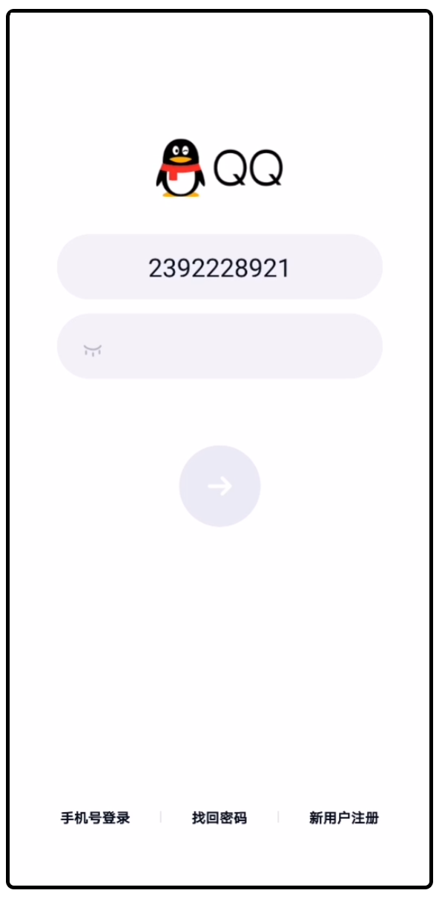

# Test qq on Android/IOS Using WeA

## test qq on android device
### Login
1.连接安卓设备
```python
init_driver(os_type=OSType.ANDROID, workspace=os.path.dirname(__file__), mode=RunMode.SINGLE,
            driver_lib=DriverLib.SCRCPY)
```


2.启动qq  
```python
start_app('com.tencent.mobileqq',
          splash_activity="com.tencent.mobileqq.activity.SpalashActivity",
          clear_app=True, clear_account=False)
```
 


3.点击 **登录**  

```python
click(login, by=DriverType.UI, timeout=20) # login为相应的Xpath
```
  

4.点击 **输入账号**, 输入qq号

```python
click(account, by=DriverType.UI, timeout=20)
input_text('qq number') # input a qq number
```
  

5.点击 **输入密码**, 输入密码  

```python
click(password, by=DriverType.UI, timeout=20)
input_text('password') # qq password
```
  
6.登录  

```python
click(confirm, by=DriverType.UI, timeout=20)
```


### 分析
- 点击app内的按钮具有多样性，demo中展示了使用Xpath的方式点击，后续会增加其他点击方式
- 需要处理一些非常规的步骤，如 **滑动验证**， **手机号码验证** 等首次登录出现的选项，后续需要优化


